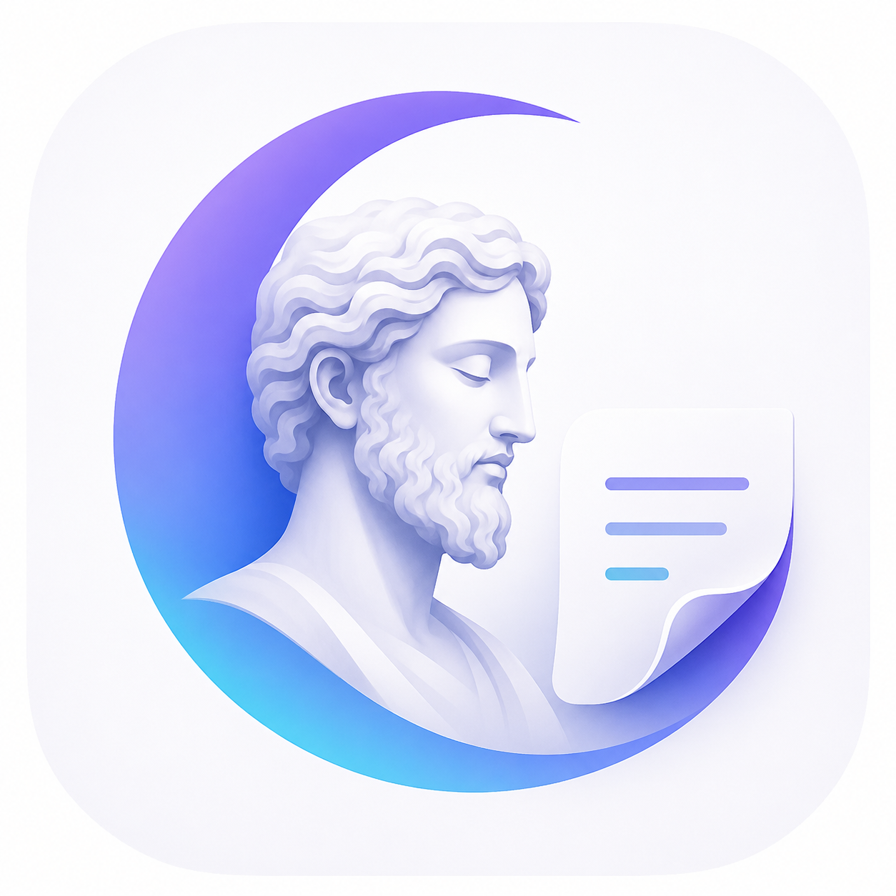

  

<h1 align="center">Morpheus Note</h1>

  <strong>Mensajes que despiertan en el momento correcto.</strong>

  Una experiencia pública, sin login, para crear notas privadas que permanecen dormidas hasta una fecha y hora definida.

  
  
  

---

## ✦ Concepto

**Morpheus Note** es una aplicación web pensada para crear mensajes que no se revelan inmediatamente.

El usuario crea una nota, define cuándo puede abrirse y comparte un **código**, un **link** o un **QR**.

Hasta que llegue el momento correcto, la nota permanece dormida.

Cuando despierta, el mensaje se presenta como una experiencia visual, paginada y opcionalmente acompañada por imagen.

---

## ✦ Idea principal

> No todo mensaje necesita leerse ahora.  
> Algunos mensajes necesitan esperar su momento.

Morpheus Note transforma una nota común en una pequeña experiencia temporal:

- Se crea el mensaje.
- Se programa su despertar.
- Se comparte mediante código, link o QR.
- Puede incluir imagen.
- Puede tener páginas.
- Puede tener pistas progresivas.
- Puede requerir palabra clave.
- Puede expirar.
- Puede ser de lectura única.

---

## ✦ Características principales

### Mensajes dormidos

Las notas permanecen bloqueadas hasta la fecha y hora configuradas.

### Sin login

La experiencia está pensada para ser directa, pública y sin fricción.

### Código público

Cada nota genera un código único para abrirla.

### Link compartible

Cada nota puede abrirse desde un enlace directo.

### QR automático

El sistema genera un código QR listo para compartir, imprimir o enviar.

### Mensaje paginado

El mensaje final puede dividirse en varias páginas, como una pequeña presentación.

### Imagen opcional

La nota puede incluir una imagen que acompaña el mensaje cuando despierta.

### Pistas progresivas

Antes de que la nota despierte, pueden aparecer pistas configuradas por tiempo.

### Multiple choice

Cada pista puede tener opciones de respuesta y solo dos intentos.

### Vencimiento configurable

La nota puede expirar después de un período definido.

### Lectura única

Opcionalmente, una nota puede quedar bloqueada después de abrirse una vez.

---

## ✦ Experiencia de uso

Morpheus Note está diseñado como una experiencia simple:

Crear nota
→ Programar fecha y hora
→ Agregar imagen o páginas
→ Activar pistas opcionales
→ Compartir código, link o QR
→ Esperar el momento correcto
→ Despertar la nota

---

## ✦ Pistas progresivas

Las pistas progresivas permiten convertir la espera en parte de la experiencia.

Una nota puede mostrar pistas antes de despertar:

Pista inicial
Pista 24 horas antes
Pista 6 horas antes
Pista 1 hora antes

Cada pista puede tener una pregunta con opciones.

La persona que intenta resolverla dispone de dos intentos.

Esto permite crear experiencias para:

- Sorpresas.
- Juegos.
- Invitaciones.
- Recuerdos.
- Mensajes personales.
- Búsquedas simbólicas.
- Eventos privados.

---

## ✦ Casos de uso

### Sorpresas personales

Crear una nota para revelar un mensaje en una fecha especial.

### Juegos entre amigos

Compartir pistas progresivas antes de liberar el mensaje final.

### Invitaciones

Enviar un QR con una nota que se desbloquea en un momento específico.

### Mensajes al futuro

Escribir una nota para una versión futura de uno mismo.

### Recuerdos

Guardar un mensaje con imagen y abrirlo cuando llegue el momento indicado.

---

## ✦ Stack técnico

### Frontend

- HTML
- CSS
- JavaScript Vanilla
- Lucide Icons
- QRCode.js
- Diseño responsive
- Animaciones CSS

### Backend

- Node.js
- Express
- PostgreSQL
- pg

### Base de datos

- PostgreSQL
- Compatible con pgAdmin

---

## ✦ Estructura general

morpheus-note/
├── backend/
│   ├── src/
│   │   ├── app.js
│   │   ├── server.js
│   │   ├── config/
│   │   ├── controllers/
│   │   ├── routes/
│   │   ├── services/
│   │   └── utils/
│   └── package.json
│
├── frontend/
│   ├── public/
│   │   ├── index.html
│   │   └── morpheus-note-icon.png
│   └── src/
│       ├── css/
│       ├── js/
│       ├── pages/
│       └── components/
│
└── README.md

---

## ✦ Módulos principales

### Crear nota

Permite configurar el contenido principal de la experiencia.

Incluye:

- Título.
- Fecha.
- Hora.
- Páginas del mensaje.
- Imagen opcional.
- Configuración de acceso.
- Pistas progresivas opcionales.

### Abrir nota

Permite intentar despertar una nota mediante código y palabra clave.

### Nota dormida

Muestra el estado de espera, cuenta regresiva y pistas disponibles.

### Nota despierta

Muestra el mensaje final en formato paginado, con imagen si fue cargada.

### Nota expirada

Indica que la nota ya no está disponible.

---

## ✦ Identidad visual

Morpheus Note usa una estética clara, moderna y suave.

La interfaz está pensada para sentirse:

- Simple.
- Amigable.
- Visual.
- Emocional.
- Ligera.
- Cercana al usuario final.

El icono combina la idea de:

- Morfeo.
- Sueño.
- Filosofía.
- Mensajes.
- Tiempo.

---

## ✦ Estado del proyecto

Morpheus Note se encuentra en etapa MVP funcional.

El objetivo principal es demostrar una experiencia original de mensajería temporal sin login, combinando mensajes programados, pistas progresivas, QR e interacción visual.

---

## ✦ Próximas mejoras posibles

- Modo ubicación.
- Audio opcional.
- Vista pública de notas dormidas.
- Modo historia.
- Plantillas para cumpleaños, eventos y mensajes al futuro.
- Exportación visual del QR.
- Modo lectura ceremonial.
- Mejor compresión de imágenes.
- Storage externo para archivos.
- Panel de administración opcional.

---

## ✦ Autor

Desarrollado por **Matias Isaac Frutos Gonzalez**.

Proyecto conceptual, técnico y visual orientado a experiencias digitales simples, públicas y memorables.

---

## ✦ Derechos

© 2026 Matias Isaac Frutos Gonzalez.  
Todos los derechos reservados.

Este proyecto, su nombre, concepto, diseño, código fuente, lógica funcional, identidad visual y recursos asociados pertenecen a su autor.

No se autoriza su copia, redistribución, uso comercial, modificación, publicación o reutilización total o parcial sin autorización expresa del autor.
